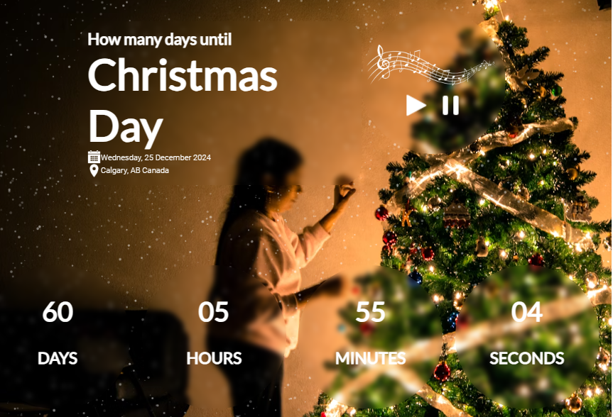
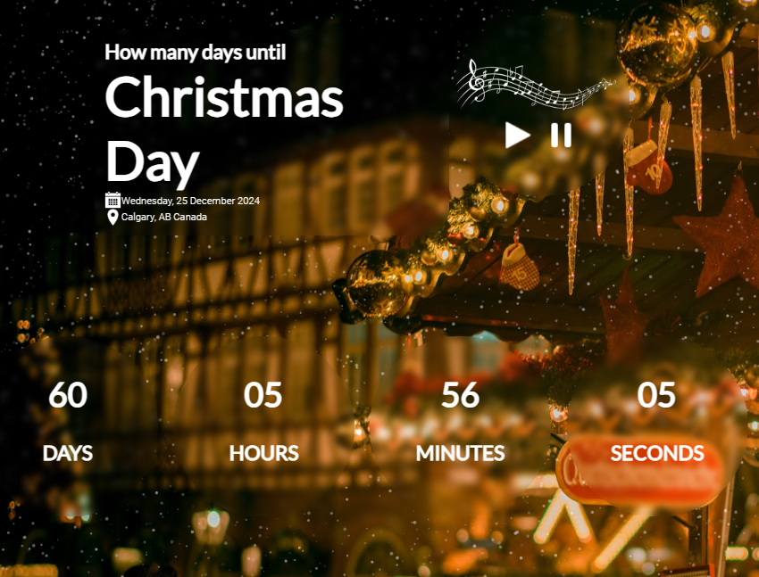

# Christmas Countdown

**Christmas Countdown** is a web application that displays a countdown to Christmas, showing the remaining days, hours, minutes, and seconds. The app creates a festive atmosphere with music, changing background images, and a snowfall effect.

## Features

- **Countdown timer** — displays the number of days, hours, minutes, and seconds until Christmas.
- **Festive music** — background music to enhance the holiday mood.
- **Background rotation** — alternating background images to celebrate the season.
- **Snowfall effect with Particles.js** — animated snow falling for a wintery feel.

## Technologies Used

- **JavaScript** — powers the timer logic and interactive elements.
- **Particles.js** — for animated snowfall effect.
- **HTML/CSS** — provides the basic structure and styling.
- **Audio/Images** — for music and background images.

## Installation and Setup

1. Clone the repository:
    ```bash
    git clone https://github.com/OksanaNova/christmas-countdown.git
    ```
2. Navigate to the project directory:
    ```bash
    cd christmas-countdown
    ```
3. Open `index.html` in your browser to launch the app.

## Screenshots




## Project Purpose

This project was created as a learning exercise to practice JavaScript, multimedia integration, and particle effects.


